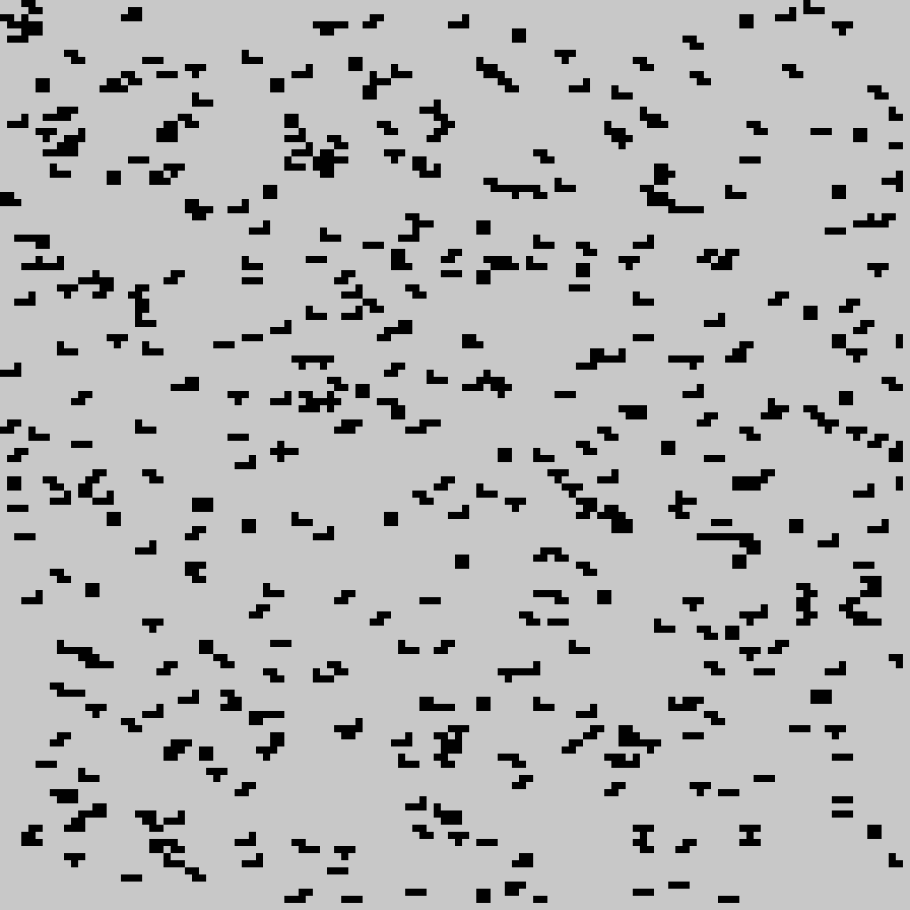
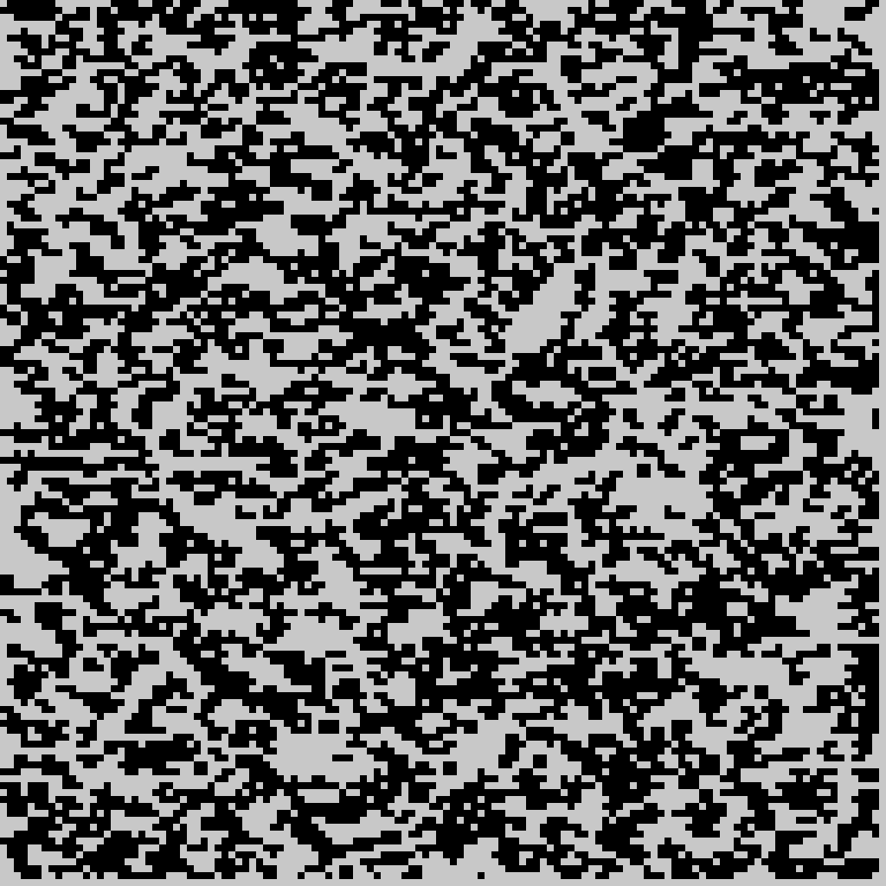
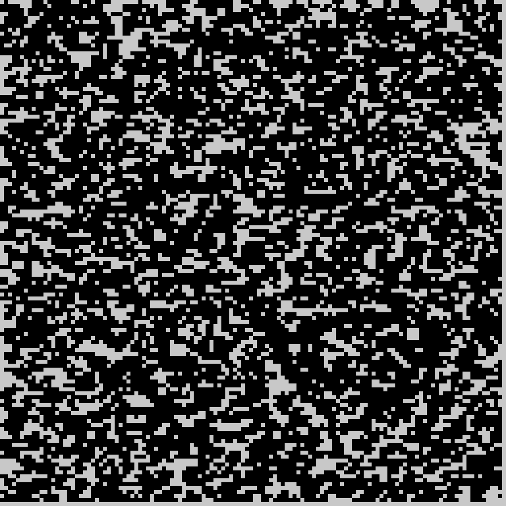

RBE 550 Motion Planning
# HW1 Getting Started

1. Motion Planning Application
   Please find PDF motion_planning_application.pdf

2. Turtle Graphics victor sierra pattern 
   
   Star - Victor Sierra Pattern

   

   Check source code /Turtle_Graphics_Star_Pattern/turtle_star_victor_sierra.py

3. Recording of ROS Turtle Sim 

   Check the video at /ROS_Turtlesim_demo.mp4

4. Obstacle Field Demonstration

   Obstacle Field 10% Occupancy
   

   Obstacle Field 50% Occupancy
   

   Obstacle Field 70% Occupancy
   

5. Introduction, Motion planning Post

      Hello everyone
      I'm Vaibhav Kadam. I am first year graduate student at RBE MS Robotics. I come from academia + Robotics industry background working as research assistant focused on "Control for Spherical Robots" and then as Robotics Engineer developing navigation stack focused on autonomy for floor cleaning robots at Peppermint Robots India. 
      Interesting motion planning applications I like about is the planning of Reconfigurable modular robots that collective complete a task configuring themselves into various different shapes in a resource constraint environments.
      Apart from robotics, I like exploring new places, meeting new people and watching movies.
      Thanks !
      Vaibhav Kadam